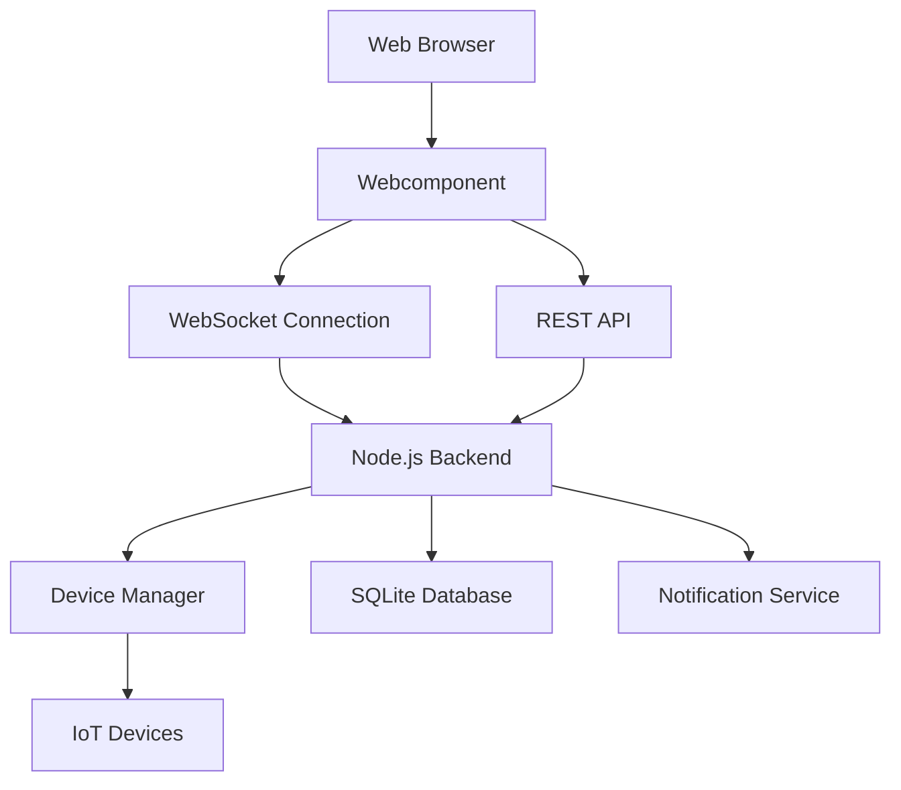

# Design Document

## Overview

The IoT Dashboard will be built as a modern single-page application (SPA) using React for the frontend and Node.js with Express for the backend. The system will use WebSocket connections for real-time device communication and a lightweight database for storing device configurations and historical data. The architecture prioritizes simplicity, real-time updates, and responsive design to meet the needs of home users across different devices.

## Architecture

### High-Level Architecture



### Technology Stack

**Frontend:**
- React 18 with TypeScript for type safety
- Material-UI (MUI) for consistent, accessible UI components
- Chart.js for data visualization
- Socket.io-client for real-time communication
- React Router for navigation

**Backend:**
- Node.js with Express framework
- Socket.io for WebSocket communication
- SQLite for local data storage (simple setup for home users)
- MQTT client for IoT device communication
- JWT for session management

**Communication Protocols:**
- HTTP/HTTPS for REST API calls
- WebSocket for real-time updates
- MQTT for IoT device communication

## Components and Interfaces

### Frontend Components

#### 1. Dashboard Layout Component
- **Purpose:** Main container with responsive grid layout
- **Props:** `devices`, `notifications`, `user`
- **State:** `selectedDevice`, `viewMode`
- **Responsibilities:**
  - Render device grid in card format
  - Handle responsive breakpoints
  - Manage global notifications display

#### 2. Device Card Component
- **Purpose:** Individual device representation
- **Props:** `device`, `onDeviceClick`, `onControlChange`
- **State:** `isLoading`, `controlValues`
- **Responsibilities:**
  - Display device status and current values
  - Provide interactive controls based on device type
  - Show offline/online status with visual indicators

#### 3. Device Control Panel
- **Purpose:** Detailed device control interface
- **Props:** `device`, `onClose`, `onUpdate`
- **State:** `settings`, `isUpdating`
- **Responsibilities:**
  - Render device-specific controls (sliders, switches, inputs)
  - Validate user input before sending commands
  - Provide feedback for successful/failed operations

#### 4. Notification Center
- **Purpose:** Display and manage notifications
- **Props:** `notifications`, `onDismiss`, `onMarkRead`
- **State:** `filter`, `expandedNotifications`
- **Responsibilities:**
  - Show real-time alerts and system messages
  - Categorize notifications by type and priority
  - Maintain notification history

#### 5. Historical Data Chart
- **Purpose:** Visualize device data over time
- **Props:** `deviceId`, `dataType`, `timeRange`
- **State:** `chartData`, `isLoading`, `selectedRange`
- **Responsibilities:**
  - Fetch and display historical data
  - Provide time range selection (24h, 7d, 30d)
  - Handle loading states and empty data scenarios

#### 6. Add Device Wizard
- **Purpose:** Guide users through device setup
- **Props:** `onComplete`, `onCancel`
- **State:** `currentStep`, `deviceInfo`, `connectionStatus`
- **Responsibilities:**
  - Multi-step device discovery and configuration
  - Validate device connections
  - Provide clear error messages and troubleshooting

### Backend Services

#### 1. Device Manager Service
- **Purpose:** Central device management and communication
- **Methods:**
  - `getDevices()`: Retrieve all registered devices
  - `addDevice(deviceInfo)`: Register new device
  - `removeDevice(deviceId)`: Unregister device
  - `sendCommand(deviceId, command)`: Send control commands
  - `getDeviceHistory(deviceId, timeRange)`: Fetch historical data
- **Responsibilities:**
  - Maintain device registry and status
  - Handle MQTT communication with devices
  - Validate device commands and responses

#### 2. Data Storage Service
- **Purpose:** Manage persistent data storage
- **Methods:**
  - `saveDeviceData(deviceId, data)`: Store device readings
  - `getHistoricalData(deviceId, startDate, endDate)`: Retrieve historical data
  - `saveDeviceConfig(deviceId, config)`: Store device configuration
  - `getDeviceConfig(deviceId)`: Retrieve device configuration
- **Responsibilities:**
  - SQLite database operations
  - Data aggregation for charts
  - Configuration persistence

#### 3. Notification Service
- **Purpose:** Handle alerts and notifications
- **Methods:**
  - `createNotification(type, message, deviceId)`: Generate notifications
  - `getNotifications(userId)`: Retrieve user notifications
  - `markAsRead(notificationId)`: Update notification status
  - `checkThresholds(deviceId, data)`: Monitor device thresholds
- **Responsibilities:**
  - Real-time alert generation
  - Threshold monitoring
  - Notification delivery via WebSocket

#### 4. WebSocket Handler
- **Purpose:** Manage real-time communication
- **Events:**
  - `device-update`: Send device status changes
  - `notification`: Send new notifications
  - `device-command`: Receive control commands from frontend
  - `connection-status`: Handle client connections
- **Responsibilities:**
  - Broadcast device updates to connected clients
  - Handle client subscriptions to specific devices
  - Manage connection lifecycle

## Data Models

### Device Model
```typescript
interface Device {
  id: string;
  name: string;
  type: 'sensor' | 'switch' | 'dimmer' | 'thermostat' | 'camera' | 'lock';
  room: string;
  status: 'online' | 'offline' | 'error';
  lastSeen: Date;
  properties: DeviceProperty[];
  controls: DeviceControl[];
  thresholds?: Threshold[];
}

interface DeviceProperty {
  key: string;
  value: any;
  unit?: string;
  timestamp: Date;
}

interface DeviceControl {
  key: string;
  type: 'switch' | 'slider' | 'input' | 'select';
  label: string;
  options?: string[];
  min?: number;
  max?: number;
}
```

### Notification Model
```typescript
interface Notification {
  id: string;
  type: 'alert' | 'warning' | 'info' | 'error';
  title: string;
  message: string;
  deviceId?: string;
  timestamp: Date;
  isRead: boolean;
  priority: 'low' | 'medium' | 'high';
}
```

### Historical Data Model
```typescript
interface HistoricalData {
  deviceId: string;
  property: string;
  value: any;
  timestamp: Date;
}
```

## Error Handling

### Frontend Error Handling
- **Network Errors:** Display user-friendly messages with retry options
- **Device Control Failures:** Show specific error messages and suggest troubleshooting
- **WebSocket Disconnections:** Automatically attempt reconnection with visual indicators
- **Validation Errors:** Provide inline validation feedback for user inputs

### Backend Error Handling
- **Device Communication Errors:** Log errors and update device status to 'error'
- **Database Errors:** Implement retry logic and fallback to in-memory storage
- **MQTT Connection Issues:** Automatic reconnection with exponential backoff
- **Invalid Commands:** Validate all device commands before execution

### Error Recovery Strategies
- **Graceful Degradation:** Continue showing cached data when real-time updates fail
- **Retry Mechanisms:** Implement exponential backoff for failed operations
- **User Feedback:** Always inform users about system status and recovery actions
- **Logging:** Comprehensive error logging for debugging and monitoring

## Testing Strategy

### Unit Testing
- **Frontend Components:** Test component rendering, props handling, and user interactions
- **Backend Services:** Test business logic, data transformations, and error scenarios
- **Utilities:** Test helper functions and data validation logic
- **Coverage Target:** Minimum 80% code coverage for critical paths

### Integration Testing
- **API Endpoints:** Test REST API responses and error handling
- **WebSocket Communication:** Test real-time message delivery and connection handling
- **Database Operations:** Test data persistence and retrieval operations
- **Device Communication:** Test MQTT message handling and device state management

### End-to-End Testing
- **User Workflows:** Test complete user journeys from device addition to control
- **Cross-Browser Testing:** Ensure compatibility across modern browsers
- **Mobile Responsiveness:** Test touch interactions and responsive layouts
- **Real-time Features:** Test WebSocket functionality and live updates

### Performance Testing
- **Load Testing:** Test system behavior with multiple concurrent users
- **Device Scalability:** Test performance with increasing number of devices
- **Real-time Performance:** Measure WebSocket message latency and throughput
- **Mobile Performance:** Test application performance on mobile devices

## Security Considerations

### Authentication & Authorization
- JWT-based session management with secure token storage
- Role-based access control for different user types
- Secure password requirements and optional two-factor authentication

### Data Protection
- HTTPS encryption for all client-server communication
- Encrypted storage of sensitive device credentials
- Regular security updates for all dependencies

### Device Security
- Secure MQTT communication with authentication
- Device credential management and rotation
- Network isolation recommendations for IoT devices

### Privacy
- Local data storage to minimize cloud dependencies
- Clear data retention policies
- User control over data sharing and export